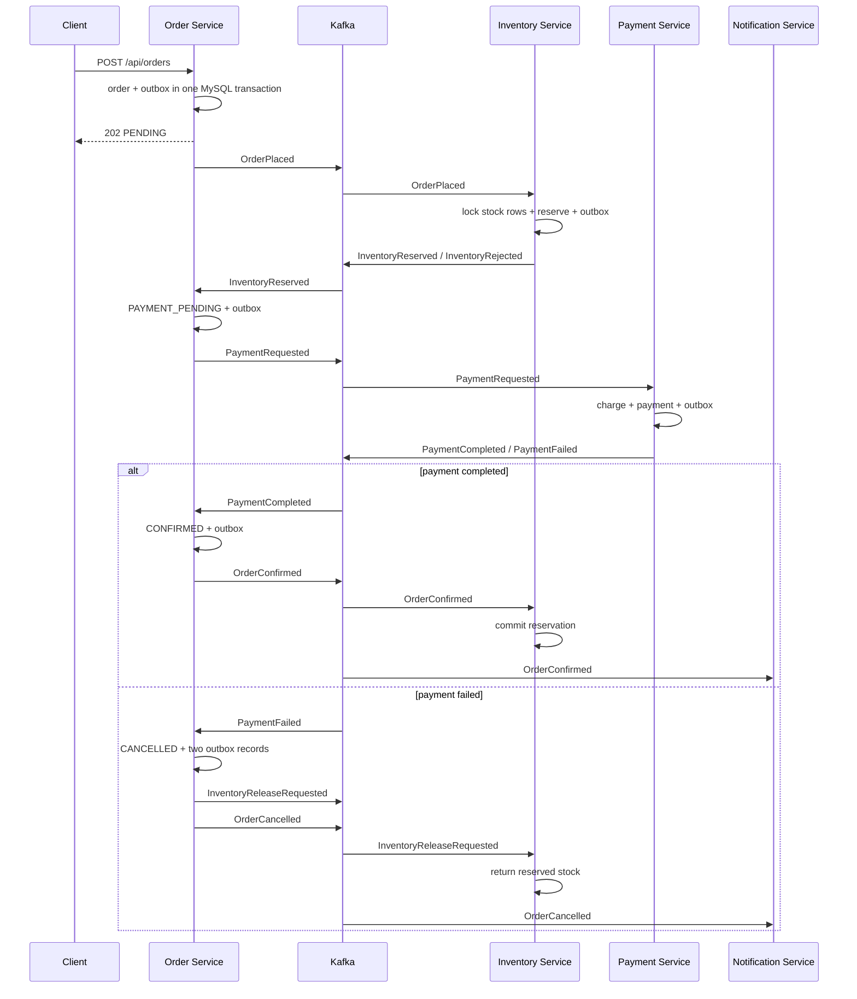

# Architecture

## Checkout saga

## Service ownership

Each service owns its schema. There are no cross-service joins.

| Service | Database | Owns |
|---|---|---|
| order-service | MySQL `orders` | orders, order items, checkout state |
| inventory-service | MySQL `inventory` | stock and reservations |
| payment-service | MySQL `payments` | payment attempts/results |
| notification-service | MySQL `notifications` | delivery audit log |

## Delivery guarantees

Kafka delivery is treated as **at least once**.

Consumers persist `event_id` in `processed_message` in the same local transaction as the business change. A duplicate delivery therefore becomes a no-op.

Producers use the transactional outbox pattern. Business data and the event payload are committed to MySQL together. A scheduled publisher later sends unpublished rows to Kafka.

A crash can happen after Kafka accepts a record but before `published_at` is committed. That can publish the same event again. Consumer idempotency is what makes this safe.

## Inventory concurrency

Reservation locks stock rows using pessimistic database locks. SKUs are sorted before locking to keep lock order deterministic and reduce deadlock risk. The application validates the complete basket before changing any stock row, so a rejected basket does not partially reserve inventory.

## What would change in production

- Kafka: 3+ brokers, replication factor 3, TLS/SASL, ACLs and explicit topic retention.
- MySQL: managed HA deployment, backups, PITR, read replicas where appropriate.
- Payment: replace the demo gateway with a PCI-compliant provider token integration.
- Secrets: Vault/cloud secret manager rather than environment values in local Compose.
- Observability: OpenTelemetry traces, Prometheus metrics and structured logs.
- Security: OAuth2/OIDC, gateway-level authorization, service identities and mTLS.
- Outbox: Debezium CDC is an alternative when throughput makes polling undesirable.
- Contracts: Schema Registry with compatibility rules (Avro/Protobuf/JSON Schema).
